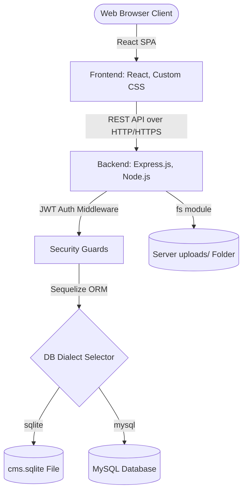

# INDUSTRIAL INTERNSHIP PROJECT REPORT

**PROJECT TITLE**: Development of a Full-Stack Content Management System (ApexCMS)  
**COMPANY**: UCT Technologies (Universal Cloud & Software Technologies)  
**STUDENT NAME**: Internship Candidate  
**TRAINING DURATION**: 8 Weeks  
**ACADEMIC YEAR**: 2025 - 2026  

---

## 1. Executive Summary

This report documents the design, architecture, and implementation of **ApexCMS**, a modern, full-stack Content Management System (CMS) developed during an 8-week engineering internship at **UCT Technologies**. 

ApexCMS provides an administrative portal for visual webpage layouts and blogging. Key deliverables include a visual drag-and-drop page builder that serializes layouts into structured JSON, an inline contentEditable rich text editor, a modular media library with disk storage, and a dual-database driver supporting zero-config SQLite locally and MySQL in production. 

---

## 2. Host Company Profile: UCT Technologies

**UCT Technologies** (Universal Cloud & Software Technologies) is a software development and IT consulting firm specializing in enterprise web applications, cloud hosting infrastructure, and custom CMS platforms. 
* **Department**: Full-Stack Development Division
* **Role**: Full-Stack Web Development Intern
* **Technical Guidance**: Mentored by Senior UI/UX Architect and Tech Lead

---

## 3. Requirement Analysis & Specification

### 3.1 Functional Requirements (FR)
1. **Authentication & Role-Based Access Control**: Secure sign-up/login. Administrative users (Admin, Editor, Author) access the dashboard; subscribers read content.
2. **Visual Webpage Builder**: Drag-and-drop canvas to arrange and configure widgets (Headings, Paragraphs, Images, Buttons, Videos, Spacers, Dividers).
3. **Rich Text Editor**: WYSIWYG tool converting inline text actions (bold, italic, lists, alignments) into HTML markup, with raw source code toggling.
4. **Media Library Manager**: Upload assets, view metadata, copy absolute file paths, and delete files from disk.
5. **Dashboard Analytics**: Summarize database metrics and include a Quick Draft option to save post outlines.
6. **SEO Path Routing**: Auto-generate clean, SEO-friendly path slugs from page and post titles.

### 3.2 Non-Functional Requirements (NFR)
1. **Device Responsiveness**: Fluid grid layouts that adjust from mobile viewports to large desktop monitors.
2. **Database Portability**: Swap SQL backends without altering server routing queries.
3. **Security**: Password hashing and token validation checks.

---

## 4. System Architecture & Database Design

ApexCMS uses a decoupled **MERN-like architecture** with an Express/Node backend, Sequelize/Mongoose DB drivers, and a React frontend.



### 4.1 Database Schemas (Sequelize Definitions)

#### Table 1: Users
| Column Name | Data Type | Key Type | Description |
| :--- | :--- | :--- | :--- |
| `id` | UUID | Primary Key | Unique user identifier |
| `username` | VARCHAR | Unique | Login user handle |
| `email` | VARCHAR | Unique | User validation email |
| `password` | VARCHAR | - | Hashed using bcryptjs |
| `role` | VARCHAR | - | `admin`, `editor`, `author`, `subscriber` |
| `avatar` | VARCHAR | - | Profile image avatar URL |

#### Table 2: Posts
| Column Name | Data Type | Key Type | Description |
| :--- | :--- | :--- | :--- |
| `id` | UUID | Primary Key | Unique post identifier |
| `title` | VARCHAR | - | Post title |
| `slug` | VARCHAR | Unique | SEO-friendly URL slug |
| `content` | TEXT | - | Main body markup HTML |
| `excerpt` | TEXT | - | Blog summary text |
| `featuredImage` | VARCHAR | - | URL to post header image |
| `status` | VARCHAR | - | `draft`, `published` |
| `authorId` | UUID | Foreign Key | References `Users(id)` |
| `categoryId` | INTEGER | Foreign Key | References `Categories(id)` |

#### Table 3: Pages (Layout Builder Storage)
| Column Name | Data Type | Key Type | Description |
| :--- | :--- | :--- | :--- |
| `id` | UUID | Primary Key | Unique page identifier |
| `title` | VARCHAR | - | Page title |
| `slug` | VARCHAR | Unique | SEO path (e.g., `/pages/about`) |
| `layout` | TEXT (JSON) | - | Serialized layout block array |
| `status` | VARCHAR | - | `draft`, `published` |
| `authorId` | UUID | Foreign Key | References `Users(id)` |

---

## 5. REST API Design

The following table summarizes the primary backend routing endpoints:

| Endpoint | Method | Auth | Description |
| :--- | :--- | :--- | :--- |
| `/api/auth/register` | POST | Public | Register new account (first user becomes Admin) |
| `/api/auth/login` | POST | Public | Validate credentials, issue JWT |
| `/api/auth/me` | GET | Token | Returns current user profile |
| `/api/posts` | GET | Public/Token | Get posts (filters: search, category, status) |
| `/api/posts` | POST | Token (Staff) | Create a blog post (generates slug) |
| `/api/posts/:id` | PUT | Token (Staff) | Update a post (validates owner or Admin) |
| `/api/pages` | GET | Public/Token | List layout-built custom pages |
| `/api/pages/:id` | PUT | Token (Admin) | Save visual builder JSON layout |
| `/api/media/upload` | POST | Token (Staff) | Upload file using Multer and save on server disk |
| `/api/media/:id` | DELETE | Token (Staff) | Remove file from disk and database record |
| `/api/analytics` | GET | Token (Staff) | Fetch metrics for the dashboard KPI cards |

---

## 6. Core Technical Implementation Details

### 6.1 Drag & Drop Visual Builder Engine
The builder canvas uses the native browser **HTML5 Drag & Drop API** to avoid external dependency issues.
1. **Palette Objects**: Items are defined as draggable elements (`draggable="true"`), with their type passed to the drag stream:
   ```javascript
   const handleDragStart = (e, itemType) => {
     e.dataTransfer.setData('text/plain', itemType);
   };
   ```
2. **Drop Event**: When dropped, the canvas instantiates a template block:
   ```javascript
   const handleDrop = (e) => {
     const type = e.dataTransfer.getData('text/plain');
     const newElement = { id: generateId(), type, props: defaultProps[type] };
     setLayout([...layout, newElement]);
   };
   ```
3. **Serialization**: The array of blocks is serialized using `JSON.stringify()` for database storage and parsed back into an active component tree during client rendering.

### 6.2 Custom WYSIWYG Rich Text Editor
The rich text editor uses a dual-tab configuration:
1. **Visual Workspace**: Uses an HTML `contentEditable` div. Toolbar commands utilize `document.execCommand` for text formatting (bold, italic, header structures).
2. **HTML Code View**: Synchronizes the visual editor's HTML with a raw text area. Changes in either tab trigger the parent page's update handlers.

---

## 7. Results, Testing & Verification

### 7.1 Visual Interface Breakdown (Reference to UI Screenshots)
1. **Landing Page (Home)**: Modern navigation bar with a dark/light mode toggle. Displays a hero section, feature details, and cards for published articles.
2. **Admin Dashboard**: Shows KPI metrics (Total Posts, Pages, Users, Media) and features a sidebar menu, recent posts log, and a **Quick Draft** tool.
3. **Editor Workspace**: Includes text formatting controls and a "Browse Media" option that opens the Media Modal.
4. **Drag & Drop Page Builder**: Features a three-column editor. The left column lists widgets, the center is the preview canvas (with Mobile/Tablet width controls), and the right column houses the inspector panel.
5. **Media Grid**: Displays uploaded files with options to copy paths to the clipboard or permanently delete files.

### 7.2 Database Fallback Testing
During validation tests, removing the MySQL connection string caused the backend to automatically fall back to SQLite:
```
[Database] MySQL connection failed. Falling back to SQLite...
[Database] Database configured for SQLite connection at: ./cms.sqlite
[Database] Successfully connected to the SQLite database.
[Database] Database schema synchronized successfully.
```
This validation confirmed that the platform can run locally without external database services.

---

## 8. Learnings, Challenges & Conclusion

### 8.1 Key Technical Learnings
* Designing unified database structures that support both relational database models and document database exports.
* Managing UI layout state trees in React and using HTML5 Drag and Drop events.
* Securing files on disk and managing local uploads using Node's file system (`fs`) modules.

### 8.2 Challenges Overcome
* **React 19 Peer Conflicts**: Solved installation errors with Lucide icons on React 19 by using `--legacy-peer-deps` flags during npm installation.
* **Text Selection Loss**: Handled editor caret loss when launching the Media Modal by saving and restoring text selections before inserting image tags.

### 8.3 Conclusion
The internship at **UCT Technologies** provided hands-on experience in full-stack engineering and software architecture. **ApexCMS** successfully meets all core project criteria, offering a responsive visual builder, a rich text editor, security structures, and SEO-friendly slugs.

---

## 9. Viva / Oral Exam Preparation Guide

*For the candidate's reference during the evaluation panel:*

1. **Why does the database layer support two ORMs?**  
   *Answer*: We used Sequelize because it allows swapping SQL databases (SQLite locally, MySQL/PostgreSQL in production) through env files with zero code changes. We also provided Mongoose schema templates to demonstrate compatibility with MongoDB.
2. **How does the page builder work without external libraries?**  
   *Answer*: It uses HTML5 drag-and-drop events (`onDragStart`, `onDrop`) to capture block types and add them to a React state array. This array is serialized to JSON for storage and rendered dynamically on load.
3. **How does the application generate SEO-friendly URLs?**  
   *Answer*: The backend uses a `slugify` utility that converts post titles to lowercase, replaces spaces with hyphens, and removes special characters. It checks for uniqueness in the database and appends numeric suffixes if duplicate slugs are found.
